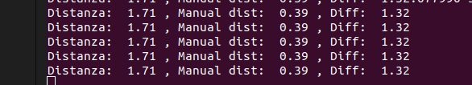

Per la calibrazione della camera ho inserito una chessboard 9x6 all'interno della scena di coppelia. Con un semplice script ho scattato delle immagini all'interno del simulatore in cui la chessboard appariva in angolazioni diverse. Quindi ho eseguito lo script di calibrazione ed ho ottenuto il seugente risultato:

[[1483.19534 0.00000 276.810683]
 [0.00000 924.841215 209.128139]
 [0.00000 0.00000 1.00000]]

Il risultato è estremamente deludente.

