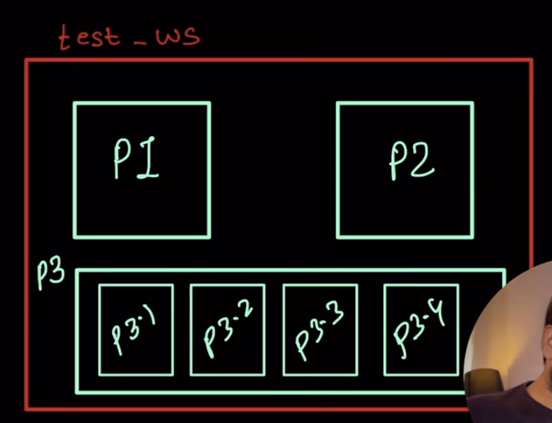
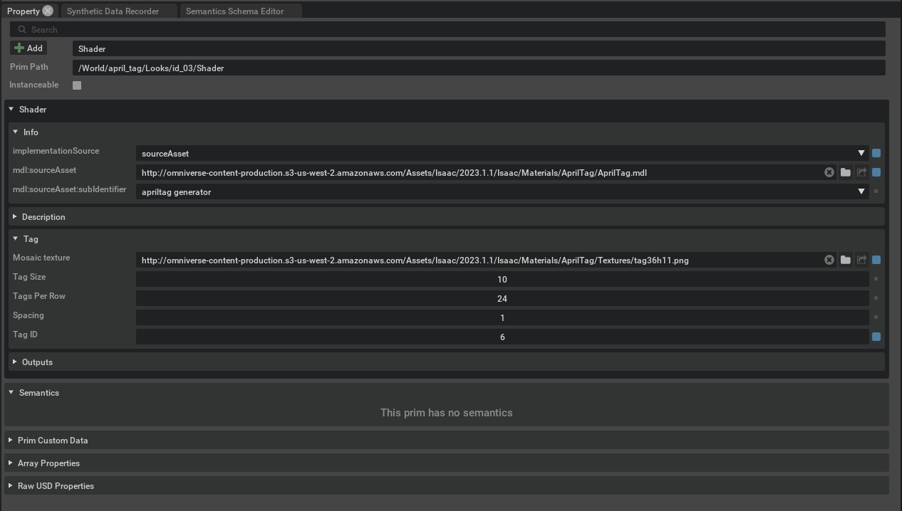

# ISAAC SIM

## What Is Isaac Sim

Isaac Sim è un toolkit di simulazione per la robotica per la piattaforma NVIDIA omniverse. Supporta navigazione e manipolazione attraverso ROS/ROS2 e anche attraverso un'api Python. Esistono anche dei sensori i cui valori vengono simulati come RGB-D, Lidar o IMU. 

### Flusso di sviluppo


### Omniverse kit

Omniverse Isaac Sim utilizza lo NVIDIA Omniverse Kit SDK per costruire applicazioni native e micro servizi. L'API Python serve per scrivere nuove estensioni o nuove applicazioni per Omniverse.

### Nucleo Omniverse
Omniverse Nucleus fornisce una serie di applicazioni, rendering e micro servizi per gestire il mondo virtuale nel simulatore. Nucleus opera sotto il modello **pub/sub**: il client può pubblicare modifiche agli asset e al mondo sul Database Nucleus oppure leggere le modifiche, che vengono trasmesse in real time alle altre app.

### USD
USD (Universal Scene Description) è il formato di file utilizzato dal simulatore per descrivere le scene. 

# References
Pagina utile per diversi esempi e link: https://docs.omniverse.nvidia.com/isaacsim/latest/reference_material/reference_tips.html

# Shortcuts
Pagina utile per link: https://docs.omniverse.nvidia.com/isaacsim/latest/shortcuts.html


# Let's start

**Gli script e le scene definite qui sono salvate nella cartella omni_scenes.**

https://www.youtube.com/watch?v=wiuRTRrr01g&t=3s

Una volta scaricato omniverse, installiamo le seguenti estensioni:
1. Python Scripting
2. Kit Debug VSCode

Nella schermata "Content", posso fare tasto destro > new Python script (behavior) e viene automaticamente creato uno script base. Facendo tasto destro > edit, viene aperto in vscode. 

A differenza del tizio, io quando creo uno script ho "carb". Credo serva per il log, ma può essere cancellato e sostituito all'interno delle funzioni con una semplice print.

```python
    from omni.kit.scripting import BehaviorScript


    class NewScript(BehaviorScript):
        def on_init(self):
            print(f"{type(self).__name__}.on_init()->{self.prim_path}")

        def on_destroy(self):
            print(f"{type(self).__name__}.on_destroy()->{self.prim_path}")

        def on_play(self):
            print(f"{type(self).__name__}.on_play()->{self.prim_path}")

        def on_pause(self):
            print(f"{type(self).__name__}.on_pause()->{self.prim_path}")

        def on_stop(self):
            print(f"{type(self).__name__}.on_stop()->{self.prim_path}")

        def on_update(self, current_time: float, delta_time: float):
            print(f"{type(self).__name__}.on_update({current_time}, {delta_time})->{self.prim_path}")
```

È una classe. Automaticamente viene anche creata una cartella .vscode con settings ecc..
Per collegare il codice al simulatore, posso premere sulla voce del menu per il debug di vscode e poi play. Il codice viene automaticamente collegato.


Per collegare lo script ad un elemento nella scena, basta:
1. Seleziono l'oggetto.
2. Tasto destro > add > python scripting/visual scripting
3. Andare in properties e cercare Scripts, quindi aggiungere lo script che si vuole caricare


A questo punto, ogni modifica che faccio viene ricaricata nella scena e può essere vista nella schermata "Console" di vscode. Inoltre, quando premo play, vedo le stampe del metodo on_update.


Ricapitolando, per assegnare uno script python ad un elemento nella scena basta:
1. Creare il file python direttamente da Isaac
2. Aprirlo con VSCode
3. Creare l'elemento nella scena
4. Cliccare tasto destro > add > python scripting sull'oggetto
5. Andare in properties e cercare Scripts, quindi aggiungere lo script

A questo punto possono essere eseguite direttamente le operazioni sull'oggetto all'interno dello script.

# Tutorial ROS2

https://docs.omniverse.nvidia.com/isaacsim/latest/ros2_tutorials/tutorial_ros2_turtlebot.html

## Installazione


https://www.youtube.com/watch?v=fsoi6faumrw

Download ROS 2 following the instructions on the official website: https://docs.ros.org/en/humble/Installation/Ubuntu-Install-Debians.html
1. ```bash
    locale  # check for UTF-8

    sudo apt update && sudo apt install locales
    sudo locale-gen en_US en_US.UTF-8
    sudo update-locale LC_ALL=en_US.UTF-8 LANG=en_US.UTF-8
    export LANG=en_US.UTF-8

    locale  # verify settings
    ```
1. ```
    sudo apt install software-properties-common
    ```
2. ```
    sudo add-apt-repository universe
    ```
3. ```
    sudo apt update && sudo apt install curl -y```
4. ``` 
    sudo curl -sSL https://raw.githubusercontent.com/ros/rosdistro/master/ros.key -o /usr/share/keyrings/ros-archive-keyring.gpg```
5. ```
    echo "deb [arch=\$(dpkg --print-architecture) signed-by=/usr/share/keyrings/ros-archive-keyring.gpg] http://packages.ros.org/ros2/ubuntu \$(. /etc/os-release && echo $UBUNTU_CODENAME) main" | sudo tee /etc/apt/sources.list.d/ros2.list > /dev/null```
6. ```
    sudo apt install ros-humble-desktop
    ```

## Creazione di un environment

Quando eseguo il comando ```source /opt/ros/humble/setup.bash``` il terminale è in grado di riconoscere i comandi di ros2. Di base è sempre necessario eseguire questo comando prima di utilizzare ros2, ma lo andiamo ad inserire nel file .bashrc in modo da essere caricato all'avvio di ubuntu.

## Workspace e pacchetti

Un workspace (ws) è un punto in cui tutti i file di un progetto sono mantenuti. All'interno di un ws possono esserci più pacchetti o gruppi di pacchetti. 



Di solito in un pacchetto ci sono il file cmakelist e il file package.xml (meta-dati sul pacchetto). Ros permette la comunicazione tra i vari pacchetti. Ciò fornisce modularità molto alta.

### Creazione di un workspace

Per la creazione del workspace utilizziamo il tool colcon (si installa con ```sudo apt install python3-colcon-common-extensions```). La creazione del ws si fa nel seguente modo:
1. Creo una cartella (test_ws) e al suo interno creo un'altra cartella src. 
2. Entro in test_ws ed eseguo il comando ```colcon build --symlink-install```. Questa opzione serve per rendere più veloci le modifiche future ai pacchetti perché invece di ricreare tutti i pacchetti fa qualcosa di più leggero.

### Creazione di un package
Una volta creato il workspace, entro nella cartella src e posso creare un pacchetto. Per fare ciò eseguo il comando ```ros2 pkg create --build-type ament_cmake <package name>```.

### Importazione di un package
Se voglio importare un package da internet, allora:ù
1. Scarico il package, ad esempio da git con ```git clone https://github.com/ros/ros_tutorials.git -b humble``` (questo pacchetto è un group package perché non ci sono cmakelist e package.xml)
2. Eseguo nella root del ws il comando ```colcon build --symlink-install```.

### Sourcing
Anche all'interno del ws bisogna eseguire il source per attivare l'environment. In questo caso, il comando sarà ```source install/setup.bash```. Anche in questo caso è possibile inserire il comando all'interno di .bashrc inserendo il percorso assoluto.

## Nodi
Quando due nodi parlano tra loro comunicano attraverso un topic. La comunicazione è identica a quella di Mosquitto.

# Installazione ROS2 + ISAAC

Una volta installato ROS2, si deve collegare a ISAAC. Per fare ciò:
1. Installazione del pacchetto vision_msgs_package tramite il comando ```sudo apt install ros-humble-vision-msgs```

## Messa in funzione ROS bridge

1.
    * Se uso un workspace ROS2 di Isaac Sim, c'è un file fastdds.xml nella root del ws.
    * Se uso un ws non ROS2 di Isaac Sim devo creare un file fastdds.xml all'interno di ~/.ros/ con il seguente codice: 

        ```xml

            <?xml version="1.0" encoding="UTF-8" ?>

            <license>Copyright (c) 2022, NVIDIA CORPORATION.  All rights reserved.
            NVIDIA CORPORATION and its licensors retain all intellectual property
            and proprietary rights in and to this software, related documentation
            and any modifications thereto.  Any use, reproduction, disclosure or
            distribution of this software and related documentation without an express
            license agreement from NVIDIA CORPORATION is strictly prohibited.</license>


            <profiles xmlns="http://www.eprosima.com/XMLSchemas/fastRTPS_Profiles" >
                <transport_descriptors>
                    <transport_descriptor>
                        <transport_id>UdpTransport</transport_id>
                        <type>UDPv4</type>
                    </transport_descriptor>
                </transport_descriptors>

                <participant profile_name="udp_transport_profile" is_default_profile="true">
                    <rtps>
                        <userTransports>
                            <transport_id>UdpTransport</transport_id>
                        </userTransports>
                        <useBuiltinTransports>false</useBuiltinTransports>
                    </rtps>
                </participant>
            </profiles>
        ```

2. Copio il percorso del file fastdds.xml ed inserisco il comando ```export FASTRTPS_DEFAULT_PROFILES_FILE=~/.ros/fastdds.xml``` all'interno della sezione extra args nel menu di avvio di Isaac Sim.
3. Una volta avviato il simulatore, vado in Window > Extensions e cerco ROS2 bridge, quindi lo attivo.

## Setup del workspace

1. clone della repository su https://github.com/NVIDIA-Omniverse/IsaacSim-ros_workspaces.git in una cartella
2. Installazione di pacchetti aggiuntivi: 
    ```bash
    # For rosdep install command
    sudo apt install python3-rosdep python3-rosinstall python3-rosinstall-generator python3-wstool build-essential
    # For colcon build command
    sudo apt install python3-colcon-common-extensions
    ```
3. ```sudo rosdep init & sudo rosdep update```
3. All'interno della cartella humble_ws, eseguo ```rosdep install -i --from-path src --rosdistro humble -y```
5. Build del workspace con ```colcon build```
6. Attivazione dell'environment locale con ```source install/local_setup.bash```

Allo stesso modo possono essere creati pacchetti personalizzati.

# Apriltags ros

PROBLEMA: apriltags richiede ros1 noetic

Per installare il nodo ros di apriltags ho eseguito i seguenti passaggi:
1. All'interno di un ws, eseguo:
    ```bash
    cd src
    git clone https://github.com/AprilRobotics/apriltag.git     
    git clone https://github.com/AprilRobotics/apriltag_ros.git
    cd ..
    rosdep install --from-paths src --ignore-src -r -y
    catkin build    
    ```

## Prova in un altro modo 

Per installare il nodo ros di apriltags ho eseguito i seguenti passaggi:
1. Installo i software necessari:
    ```bash
    sudo apt-get install git-lfs
    git lfs install --skip-repo    
    ```
1. Creo un nuovo workspace:
    ```bash
    mkdir -p  <path-to-dir>/isaac_ros-dev/src
    echo "export ISAAC_ROS_WS=<path-to-dir>/isaac_ros-dev/" >> ~/.bashrc
    source ~/.bashrc
    ```
2. Clono i package necessari:
    ```bash
    cd ${ISAAC_ROS_WC}/src
    git clone https://github.com/NVIDIA-ISAAC-ROS/isaac_ros_common.git
    git clone https://github.com/NVIDIA-ISAAC-ROS/isaac_ros_apriltag.git
    cd ${ISAAC_ROS_WS}/src/isaac_ros_apriltag && git lfs pull -X "" -I "resources/rosbags/quickstart.bag"

    ```

A questo punto è richiesto l'utilizzo di docker ma vorrei trovare una soluzione che non lo richieda


## Creazione dei tag nella scena

Per creare un tag nella scena seguo i seguenti passaggi:

1. Create > Isaac > April Tag > tag36h11, quindi attendo (tanto) che il tag venga caricato. A questo punto avrò una cartella "Looks" con un materiale AprilTag e il relativo shader.

2. Rinomino il tag AprilTag chiamandolo tag_<id>

1. Controllo che i parametri dello shader siano i seguenti



e che facendo tasto destro sul material, quindi "Open in MDL Material Graph", la situazione sia la seguente:


3. Creo un piano tramite Create > Mesh > Plane e nelle proprietà gli assegno come materiale il tag definito.


# Turtlebot3 e ros2

## Import del turtlebot tramite URDF

URDF è uno strumento per importare robot. 

1. All'internod del workspace fornito (IsaacSim-ros_workspaces scaricato nella sezione INSTALLAZIONE ROS2 + ISAAC > SETUP DEL WORKSPACE), nella cartella humble_ws/src faccio ```git clone -b humble-devel https://github.com/ROBOTIS-GIT/turtlebot3.git turtlebot3```
2. Torno nella cartella humble_ws ed eseguo:
    ```bash
    rosdep install -i --from-path src --rosdistro humble -y
    colcon build --packages-select turtlebot3_description
    ```
    In questo modo installo solo il package turtlebot3_description
3. Nel simulatore creo un pavimento, poi faccio Isaac Utils > Workflows > URDF Importer, quindi:
    * Rimuovo la spunta in clear stage
    * Rimuovo la spunta in Fix Base Link (perché è un robot mobile)
    * Imposto Joint Drive Type a Velocity
    * Scelgo il robot nella casella Input File, 
    * Mi assicuro che non ho selezionato nessun elemento della scena, quindi clicco su import

    Una volta importato il robot è possibile modificare proprietà fisiche o di attrito per ottimizzarle al meglio rispetto alla scena. 


Continuare seguendo https://docs.omniverse.nvidia.com/isaacsim/latest/ros2_tutorials/tutorial_ros2_drive_turtlebot.html

# Scripting diretto

Ho provato ad eseguire script esterni al simulatore che si interfacciano con esso ed inviano dei comandi. Sono sorti diversi problemi: 
1. L'import di omni.isaac funziona solo in alcuni casi. Capire bene come poterlo importare sempre.
2. Una volta fatto l'import, l'import di dynamic_control non funziona perché si crea un ciclo di import.

https://docs.omniverse.nvidia.com/dev-guide/latest/dev_guide/develop/develop.html
https://docs.omniverse.nvidia.com/py/isaacsim/source/extensions/omni.isaac.core/docs/index.html