# ISAAC SIM

## What Is Isaac Sim

Isaac Sim è un toolkit di simulazione per la robotica per la piattaforma NVIDIA omniverse. Supporta navigazione e manipolazione attraverso ROS/ROS2 e anche attraverso un'api Python. Esistono anche dei sensori i cui valori vengono simulati come RGB-D, Lidar o IMU.

### Flusso di sviluppo

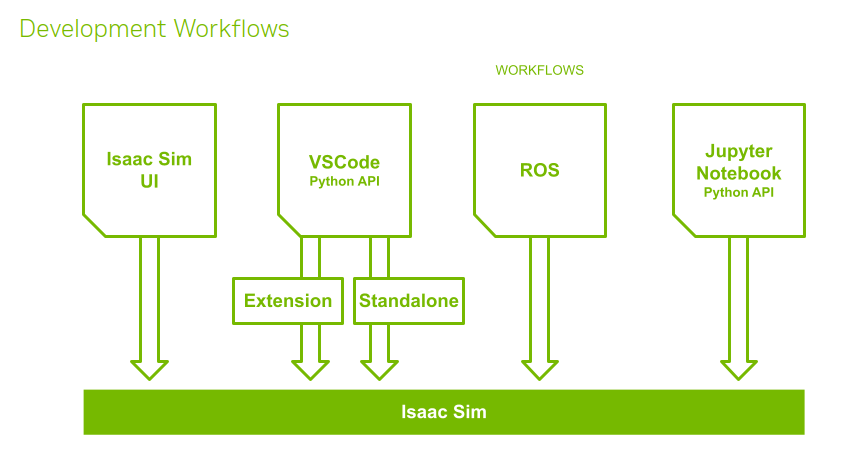

### Omniverse kit

Omniverse Isaac Sim utilizza lo NVIDIA Omniverse Kit SDK per costruire applicazioni native e micro servizi. L'API Python serve per scrivere nuove estensioni o nuove applicazioni per Omniverse.

### Nucleo Omniverse

Omniverse Nucleus fornisce una serie di applicazioni, rendering e micro servizi per gestire il mondo virtuale nel simulatore. Nucleus opera sotto il modello **pub/sub**: il client può pubblicare modifiche agli asset e al mondo sul Database Nucleus oppure leggere le modifiche, che vengono trasmesse in real time alle altre app.

### USD

USD (Universal Scene Description) è il formato di file utilizzato dal simulatore per descrivere le scene.

# References

Pagina utile per diversi esempi e link: https://docs.omniverse.nvidia.com/isaacsim/latest/reference_material/reference_tips.html

# Shortcuts

Pagina utile per link: https://docs.omniverse.nvidia.com/isaacsim/latest/shortcuts.html

# Let's start

**Gli script e le scene definite qui sono salvate nella cartella omni_scenes.**

https://www.youtube.com/watch?v=wiuRTRrr01g&t=3s

Una volta scaricato omniverse, installiamo le seguenti estensioni:

1. Python Scripting
2. Kit Debug VSCode

Nella schermata "Content", posso fare tasto destro > new Python script (behavior) e viene automaticamente creato uno script base. Facendo tasto destro > edit, viene aperto in vscode.

A differenza del tizio, io quando creo uno script ho "carb". Credo serva per il log, ma può essere cancellato e sostituito all'interno delle funzioni con una semplice print.

```python
    from omni.kit.scripting import BehaviorScript


    class NewScript(BehaviorScript):
        def on_init(self):
            print(f"{type(self).__name__}.on_init()->{self.prim_path}")

        def on_destroy(self):
            print(f"{type(self).__name__}.on_destroy()->{self.prim_path}")

        def on_play(self):
            print(f"{type(self).__name__}.on_play()->{self.prim_path}")

        def on_pause(self):
            print(f"{type(self).__name__}.on_pause()->{self.prim_path}")

        def on_stop(self):
            print(f"{type(self).__name__}.on_stop()->{self.prim_path}")

        def on_update(self, current_time: float, delta_time: float):
            print(f"{type(self).__name__}.on_update({current_time}, {delta_time})->{self.prim_path}")
```

È una classe. Automaticamente viene anche creata una cartella .vscode con settings ecc..
Per collegare il codice al simulatore, posso premere sulla voce del menu per il debug di vscode e poi play. Il codice viene automaticamente collegato.

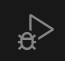

Per collegare lo script ad un elemento nella scena, basta:

1. Seleziono l'oggetto.
2. Tasto destro > add > python scripting/visual scripting
3. Andare in properties e cercare Scripts, quindi aggiungere lo script che si vuole caricare

A questo punto, ogni modifica che faccio viene ricaricata nella scena e può essere vista nella schermata "Console" di vscode. Inoltre, quando premo play, vedo le stampe del metodo on_update.

Ricapitolando, per assegnare uno script python ad un elemento nella scena basta:

1. Creare il file python direttamente da Isaac
2. Aprirlo con VSCode
3. Creare l'elemento nella scena
4. Cliccare tasto destro > add > python scripting sull'oggetto
5. Andare in properties e cercare Scripts, quindi aggiungere lo script

A questo punto possono essere eseguite direttamente le operazioni sull'oggetto all'interno dello script.

# Tutorial ROS2

https://docs.omniverse.nvidia.com/isaacsim/latest/ros2_tutorials/tutorial_ros2_turtlebot.html

## Installazione

https://www.youtube.com/watch?v=fsoi6faumrw

Download ROS 2 following the instructions on the official website: https://docs.ros.org/en/humble/Installation/Ubuntu-Install-Debians.html

1. ```bash
   locale  # check for UTF-8

   sudo apt update && sudo apt install locales
   sudo locale-gen en_US en_US.UTF-8
   sudo update-locale LC_ALL=en_US.UTF-8 LANG=en_US.UTF-8
   export LANG=en_US.UTF-8

   locale  # verify settings
   ```

1. ```
   sudo apt install software-properties-common
   ```
1. ```
   sudo add-apt-repository universe
   ```
1. ````
   sudo apt update && sudo apt install curl -y```
   ````
1. ````
   sudo curl -sSL https://raw.githubusercontent.com/ros/rosdistro/master/ros.key -o /usr/share/keyrings/ros-archive-keyring.gpg```
   ````
1. ````
   echo "deb [arch=\$(dpkg --print-architecture) signed-by=/usr/share/keyrings/ros-archive-keyring.gpg] http://packages.ros.org/ros2/ubuntu \$(. /etc/os-release && echo $UBUNTU_CODENAME) main" | sudo tee /etc/apt/sources.list.d/ros2.list > /dev/null```
   ````
1. ```
   sudo apt install ros-humble-desktop
   ```

## Creazione di un environment

Quando eseguo il comando `source /opt/ros/humble/setup.bash` il terminale è in grado di riconoscere i comandi di ros2. Di base è sempre necessario eseguire questo comando prima di utilizzare ros2, ma lo andiamo ad inserire nel file .bashrc in modo da essere caricato all'avvio di ubuntu.

## Workspace e pacchetti

Un workspace (ws) è un punto in cui tutti i file di un progetto sono mantenuti. All'interno di un ws possono esserci più pacchetti o gruppi di pacchetti.

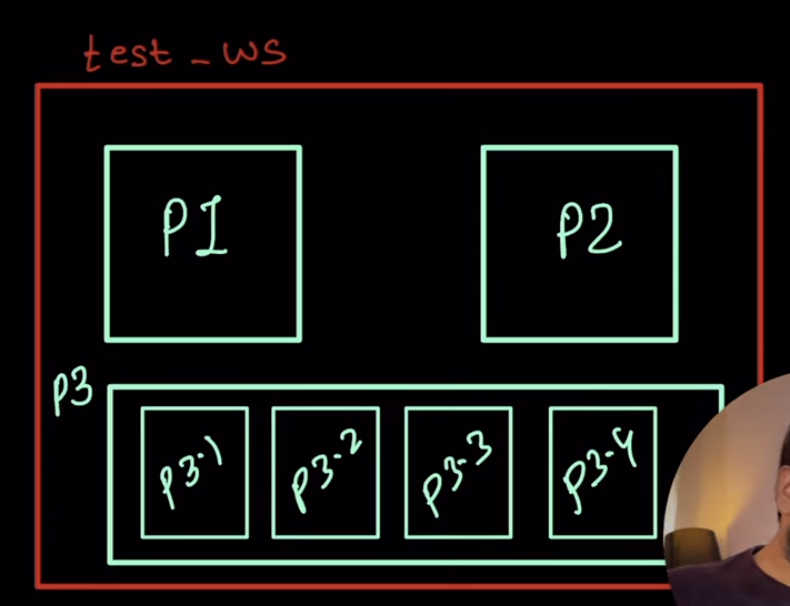

Di solito in un pacchetto ci sono il file cmakelist e il file package.xml (meta-dati sul pacchetto). Ros permette la comunicazione tra i vari pacchetti. Ciò fornisce modularità molto alta.

### Creazione di un workspace

Per la creazione del workspace utilizziamo il tool colcon (si installa con `sudo apt install python3-colcon-common-extensions`). La creazione del ws si fa nel seguente modo:

1. Creo una cartella (test_ws) e al suo interno creo un'altra cartella src.
2. Entro in test_ws ed eseguo il comando `colcon build --symlink-install`. Questa opzione serve per rendere più veloci le modifiche future ai pacchetti perché invece di ricreare tutti i pacchetti fa qualcosa di più leggero.

### Creazione di un package

Una volta creato il workspace, entro nella cartella src e posso creare un pacchetto. Per fare ciò eseguo il comando `ros2 pkg create --build-type ament_cmake <package name>`.

### Importazione di un package

Se voglio importare un package da internet, allora:ù

1. Scarico il package, ad esempio da git con `git clone https://github.com/ros/ros_tutorials.git -b humble` (questo pacchetto è un group package perché non ci sono cmakelist e package.xml)
2. Eseguo nella root del ws il comando `colcon build --symlink-install`.

### Sourcing

Anche all'interno del ws bisogna eseguire il source per attivare l'environment. In questo caso, il comando sarà `source install/setup.bash`. Anche in questo caso è possibile inserire il comando all'interno di .bashrc inserendo il percorso assoluto.

## Nodi

Quando due nodi parlano tra loro comunicano attraverso un topic. La comunicazione è identica a quella di Mosquitto.

# Installazione ROS2 + ISAAC

Una volta installato ROS2, si deve collegare a ISAAC. Per fare ciò:

1. Installazione del pacchetto vision_msgs_package tramite il comando `sudo apt install ros-humble-vision-msgs`

## Messa in funzione ROS bridge

1.  - Se uso un workspace ROS2 di Isaac Sim, c'è un file fastdds.xml nella root del ws.
    - Se uso un ws non ROS2 di Isaac Sim devo creare un file fastdds.xml all'interno di ~/.ros/ con il seguente codice:

      ```xml

          <?xml version="1.0" encoding="UTF-8" ?>

          <license>Copyright (c) 2022, NVIDIA CORPORATION.  All rights reserved.
          NVIDIA CORPORATION and its licensors retain all intellectual property
          and proprietary rights in and to this software, related documentation
          and any modifications thereto.  Any use, reproduction, disclosure or
          distribution of this software and related documentation without an express
          license agreement from NVIDIA CORPORATION is strictly prohibited.</license>


          <profiles xmlns="http://www.eprosima.com/XMLSchemas/fastRTPS_Profiles" >
              <transport_descriptors>
                  <transport_descriptor>
                      <transport_id>UdpTransport</transport_id>
                      <type>UDPv4</type>
                  </transport_descriptor>
              </transport_descriptors>

              <participant profile_name="udp_transport_profile" is_default_profile="true">
                  <rtps>
                      <userTransports>
                          <transport_id>UdpTransport</transport_id>
                      </userTransports>
                      <useBuiltinTransports>false</useBuiltinTransports>
                  </rtps>
              </participant>
          </profiles>
      ```

2.  Copio il percorso del file fastdds.xml ed inserisco il comando `export FASTRTPS_DEFAULT_PROFILES_FILE=~/.ros/fastdds.xml` all'interno della sezione extra args nel menu di avvio di Isaac Sim.
3.  Una volta avviato il simulatore, vado in Window > Extensions e cerco ROS2 bridge, quindi lo attivo.

## Setup del workspace

1. clone della repository su https://github.com/NVIDIA-Omniverse/IsaacSim-ros_workspaces.git in una cartella
2. Installazione di pacchetti aggiuntivi:
   ```bash
   # For rosdep install command
   sudo apt install python3-rosdep python3-rosinstall python3-rosinstall-generator python3-wstool build-essential
   # For colcon build command
   sudo apt install python3-colcon-common-extensions
   ```
3. `sudo rosdep init & sudo rosdep update`
4. All'interno della cartella humble_ws, eseguo `rosdep install -i --from-path src --rosdistro humble -y`
5. Build del workspace con `colcon build`
6. Attivazione dell'environment locale con `source install/local_setup.bash`

Allo stesso modo possono essere creati pacchetti personalizzati.

# Apriltags ros

PROBLEMA: apriltags richiede ros1 noetic

Per installare il nodo ros di apriltags ho eseguito i seguenti passaggi:

1. All'interno di un ws, eseguo:
   ```bash
   cd src
   git clone https://github.com/AprilRobotics/apriltag.git
   git clone https://github.com/AprilRobotics/apriltag_ros.git
   cd ..
   rosdep install --from-paths src --ignore-src -r -y
   catkin build
   ```

## Prova in un altro modo

Per installare il nodo ros di apriltags ho eseguito i seguenti passaggi:

1. Installo i software necessari:
   ```bash
   sudo apt-get install git-lfs
   git lfs install --skip-repo
   ```
1. Creo un nuovo workspace:
   ```bash
   mkdir -p  <path-to-dir>/isaac_ros-dev/src
   echo "export ISAAC_ROS_WS=<path-to-dir>/isaac_ros-dev/" >> ~/.bashrc
   source ~/.bashrc
   ```
1. Clono i package necessari:

   ```bash
   cd ${ISAAC_ROS_WC}/src
   git clone https://github.com/NVIDIA-ISAAC-ROS/isaac_ros_common.git
   git clone https://github.com/NVIDIA-ISAAC-ROS/isaac_ros_apriltag.git
   cd ${ISAAC_ROS_WS}/src/isaac_ros_apriltag && git lfs pull -X "" -I "resources/rosbags/quickstart.bag"

   ```

A questo punto è richiesto l'utilizzo di docker ma vorrei trovare una soluzione che non lo richieda

## Creazione dei tag nella scena

Per creare un tag nella scena seguo i seguenti passaggi:

1. Create > Isaac > April Tag > tag36h11, quindi attendo (tanto) che il tag venga caricato. A questo punto avrò una cartella "Looks" con un materiale AprilTag e il relativo shader.

2. Rinomino il tag AprilTag chiamandolo tag\_<id>

3. Controllo che i parametri dello shader siano i seguenti

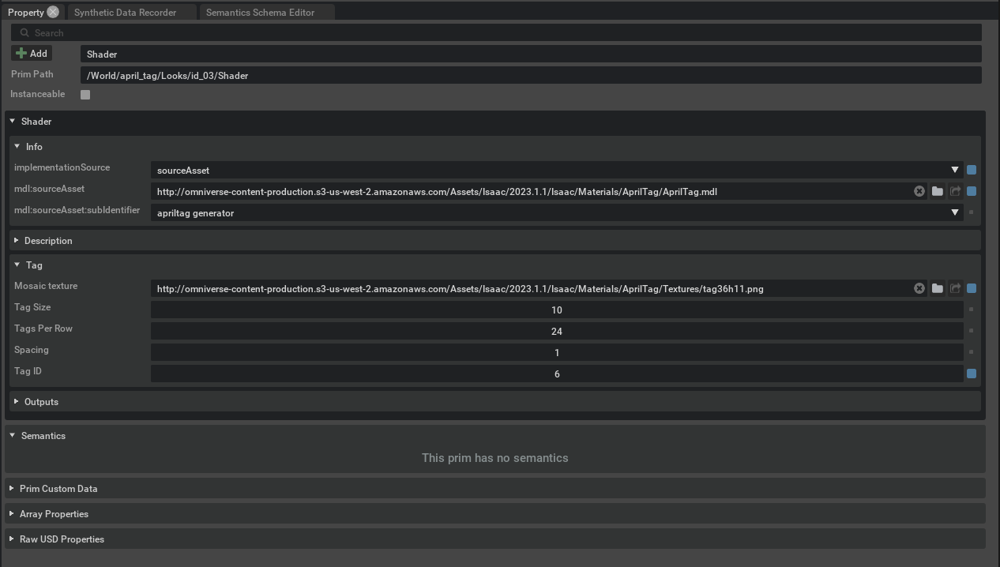

e che facendo tasto destro sul material, quindi "Open in MDL Material Graph", la situazione sia la seguente:

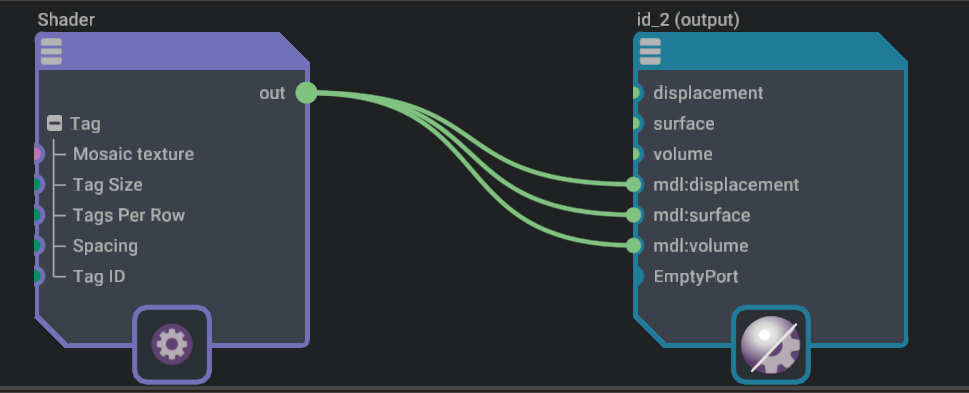

3. Creo un piano tramite Create > Mesh > Plane e nelle proprietà gli assegno come materiale il tag definito.

# Turtlebot3 e ros2

## Import del turtlebot tramite URDF

URDF è uno strumento per importare robot.

1. All'internod del workspace fornito (IsaacSim-ros_workspaces scaricato nella sezione INSTALLAZIONE ROS2 + ISAAC > SETUP DEL WORKSPACE), nella cartella humble_ws/src faccio `git clone -b humble-devel https://github.com/ROBOTIS-GIT/turtlebot3.git turtlebot3`
2. Torno nella cartella humble_ws ed eseguo:
   ```bash
   rosdep install -i --from-path src --rosdistro humble -y
   colcon build --packages-select turtlebot3_description
   ```
   In questo modo installo solo il package turtlebot3_description
3. Nel simulatore creo un pavimento, poi faccio Isaac Utils > Workflows > URDF Importer, quindi:

   - Rimuovo la spunta in clear stage
   - Rimuovo la spunta in Fix Base Link (perché è un robot mobile)
   - Imposto Joint Drive Type a Velocity
   - Scelgo il robot nella casella Input File,
   - Mi assicuro che non ho selezionato nessun elemento della scena, quindi clicco su import

   Una volta importato il robot è possibile modificare proprietà fisiche o di attrito per ottimizzarle al meglio rispetto alla scena.

Continuare seguendo https://docs.omniverse.nvidia.com/isaacsim/latest/ros2_tutorials/tutorial_ros2_drive_turtlebot.html

# Scripting diretto

Ho provato ad eseguire script esterni al simulatore che si interfacciano con esso ed inviano dei comandi. Sono sorti diversi problemi:

1. L'import di omni.isaac funziona solo in alcuni casi. Capire bene come poterlo importare sempre.
2. Una volta fatto l'import, l'import di dynamic_control non funziona perché si crea un ciclo di import.

https://docs.omniverse.nvidia.com/dev-guide/latest/dev_guide/develop/develop.html
https://docs.omniverse.nvidia.com/py/isaacsim/source/extensions/omni.isaac.core/docs/index.html

Esistono due modi di eseguire scripting diretto:

1. Tramite estensioni (non creano una nuova istanza del simulatore)
2. App standalone (creano necessariamente una nuova istanza del simulatore)

Per eseguire il codice Python con le librerie Isaac bisogna utilizzare l'environment fornito da loro. Ciò può essere fatto eseguendo il python.sh (.bat in windows) e passando come argomento il percorso del file python. In linux ho creato il comando isaac_py che esegue il python di Isaac. Per aggiungere dei moduli a quel python credo si possano inserire all'interno del requirements.txt.

Per il debugging da VSCode è possibile aprire direttamente la cartella di Isaac (percorso `~/home/daniele/.local/share/ov/pkg/isaac_sim ...` in linux,`C:\Users\danyb\AppData\Local\ov\pkg\isaac_sim-2023.1.1` in windows ) da vscode ed eseguire il codice con il debugger "Attach ...".

## Testing Extensions with Python

https://docs.omniverse.nvidia.com/kit/docs/kit-manual/latest/guide/testing_exts_python.html

## Isaac Sim Workflows

https://docs.omniverse.nvidia.com/isaacsim/latest/introductory_tutorials/tutorial_intro_workflows.html

## Esempi interessanti

- Braccio che segue il cubo (standalone):  
   `isaac_sim-2023.1.1\standalone_examples\api\omni.isaac.franka\follow_target_with_rmpflow.py`
- Add cubes (standalone):
  `isaac_sim-2023.1.1\standalone_examples\api\omni.isaac.core\add_cubes.py`

Su windows, eseguiti con isaac_sim-2023.1.1\python.bat ci mettono 10 minuti per avviarsi. L'esecuzione con il debugger non funziona.

## Estensione REPL

REPL è una shell che esegue frammenti di codice Python. Funziona solo su Linux e si usa nel seguente modo:

1. Un'istanza di Isaac deve essere già in esecuzione
2. Windows > Extensions, cerco Isaac Sim REPL e la abilito, selezionando anche Autoload.
3. Apro un terminale ed eseguo `telnet localhost 8223`. Si apre una shell python che esegue codice una linea alla volta.
4. Per uscire Ctrl+D.

## Isaac Sim Core APIs

Le core APis semplificano molte delle operazioni che possono essere fatte sul simulatore.

## Video: can we simulate a real robot?

1. Lui utilizza sempre il python fornito da Isaac per eseguire il codice.
2. Per risolvere il problema del riavvio, semplicemente esegue il codice principale solo una volta (modulo action) e passa dei parametri tramite scrittura su file.

Ho seguito il metodo che utilizza lui sul robot jetbot e funziona. Adesso devo prendere i dati della camera. Per eseguire i vari programmi test **utilizzo il python fornito da Isaac (in linux il mio comando isaac_py)**.

## Lettura della camera

```python
    from omni.isaac.sensor import Camera
    from PIL import Image

    camera = Camera(prim_path="/World/jetbot/chassis/rgb_camera/jetbot_camera")
    camera.initialize()
    rgba_array = camera.get_current_frame()["rgba"]
    image = Image.fromarray(rgba_array.astype('uint8'))
    image.show()
```

Con un apriltag davanti, ecco il primo risultato:

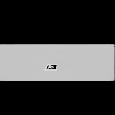

Posso impostare una risoluzione a piacere, ottenendo un'immagine decisamente migliore.

```python
    camera = Camera(prim_path="/World/jetbot/chassis/rgb_camera/jetbot_camera", resolution=(1024, 1024))
```


Documentazione api camera:
https://docs.omniverse.nvidia.com/py/isaacsim/source/extensions/omni.isaac.sensor/docs/index.html#module-omni.isaac.sensor.scripts.camera

## Caricamento scena

Basandomi su https://forums.developer.nvidia.com/t/import-usd-scene-in-python/244651/4

Ho scritto il codice per il caricamento di una scena e per il recupero degli elementi dalla stessa (test_2). Ho notato inoltre un netto miglioramento nella velocità di caricamento della scena, forse dovuto ai parametri di CONFIG.

In questo modo posso costruire manualmente una qualsiasi scena e quindi caricarla tramite lo script python.

## Inclusione mosquitto

Per installare pacchetti aggiuntivi si può usare il comando `./python.sh -m pip install name_of_package_here`.

Prima di eseguire questo, ho aggiornato pip con `isaac_py -m pip install --upgrade pip`.

### Esempio di navigazione con tasti della tastiera

1. `pip install pynput`

2. ```python
       from pynput import keyboard

       def on_press(key):
           try:
               if key == keyboard.Key.up:
                   print("Freccia su premuta")
                   # Esegui l'operazione per la freccia su
               elif key == keyboard.Key.down:
                   print("Freccia giù premuta")
                   # Esegui l'operazione per la freccia giù
               elif key == keyboard.Key.left:
                   print("Freccia sinistra premuta")
                   # Esegui l'operazione per la freccia sinistra
               elif key == keyboard.Key.right:
                   print("Freccia destra premuta")
                   # Esegui l'operazione per la freccia destra
           except AttributeError:
               pass

       # Registra la funzione on_press come callback per i press dei tasti
       with keyboard.Listener(on_press=on_press) as listener:
           listener.join()


   ```

### Installazione di mosquitto in locale

1. `sudo apt-get install mosquitto`
1. `sudo apt install mosquitto-clients`
1. `mosquitto` per avviarlo.
1. `sudo systemctl stop mosquitto` per interromperlo

In questo modo il broker sarà in ascolto sull'indirizzo localhost e sulla porta 1883. Per vedere se c'è un processo già sulla porta 1883 si può eseguire `sudo lsof -i :1883`.

### Lentezza dell'esecuzioned elle app standalone

https://forums.developer.nvidia.com/t/faster-standalone-application-start-loading/202403

La lentezza può essere ridotta se si utilizza la cache, attivabile dal launcher di Omniverse.

### Lettura apriltags nell'immagine

1. Installo opencv con `isaac_py -m pip install opencv-python`
2. Ho modificato la camera predefinita del jetbot perché l'immagine era rettangolare e stretta. Ho incluso una nuova camera ed ho regolato i parametri per adattarli alle mie necessità.
3. Installo pyapriltags https://pypi.org/project/pyapriltags/

Per leggere in modo accurato gli apriltags ho bisogno degli intrinsics della videocamera, ovvero parametri interni quali lunghezza focale e centro ottico.

Un metodo che ho utilizzato per calcolarli è quello nel seguente link:

https://forums.developer.nvidia.com/t/change-intrinsic-camera-parameters/180309/4

Devo eseguire dei test per capire se la distanza è calcolata correttamente.

#### Calibrazione con scacchiera

Per un risultato perfetto, l'ideale è la calibrazione con la scacchiera. Ho inserito una scacchiera all'interno della scena con la seguente procedura:

1. Creo un plane
2. Creo un Material > OmniPBR
3. Tra le proprietà del material, assegno ad Albedo map il file dell'immagine
4. Assegno al plane il material creato.

A questo punto scatto diverse immagini della scacchiera tramite un semplice programma.

### Recupero della posizione di un prim nella scena

```python
    stage = omni.usd.get_context().get_stage()
    prim = stage.GetPrimAtPath(Constants.CAMERA_PRIM_PATH)
    matrix: Gf.Matrix4d = omni.usd.get_world_transform_matrix(prim)
    translate: Gf.Vec3d = matrix.ExtractTranslation()
    print(f"Camera pos: {translate}")
```

# Riassunto calibrazione videocamera:

fonti:

- https://docs.nvidia.com/isaac/archive/2020.2/packages/fiducials/doc/apriltags.html
- https://docs.opencv.org/4.x/dc/dbb/tutorial_py_calibration.html

La libreria apriltag, per il calcolo della distanza del tag dalla camera e del suo orientamento, richiede i valori cosiddetti intrinsics della videocamera, ovvero:

- Camera focal length in X e Y in pixel per radianti.
- Centro focale (Camera principal points) in X e Y.
- Lato del tag (quadrato) in metri.

Tali intrinsics, come si può intuire dal nome, sono intrinsechi della fotocamera e possono quindi essere ricavati solo da essa. Se tali valori non sono noti, possono essere ricavati tramite l'ausilio di una scacchiera.

https://nikatsanka.github.io/camera-calibration-using-opencv-and-python.html

Tale procedimento consiste nell'inserire una scacchiera all'interno della scena, quindi catturare dei frame in cui la scacchiera si trova in diverse posizioni e darli "in pasto" all'algoritmo.

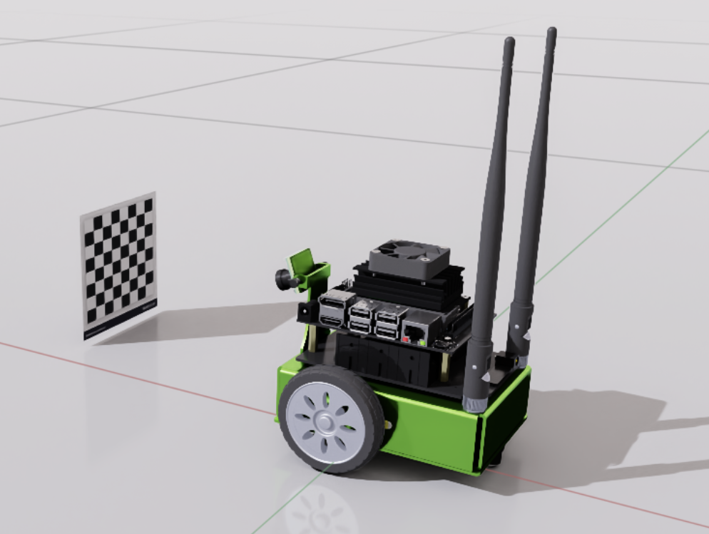

Quest'ultimo, tramite appositi metodi della libreria OpenCV, calcola l'errore che c'è nelle forme della scacchiera che dovrebbero essere quadrate, quindi ricava tali valori.

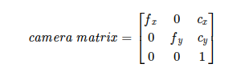

Nel nostro caso, gli intrinsics sono:

$$
camera\_matrix = \begin{bmatrix}
433.028 & 0.0 & 541.725 \\
0.0 & 415.378 & 659.105 \\
0.0 & 0.0 & 1.0 \\
\end{bmatrix}
$$

A questo punto posso utilizzare tali valori nella detection.

**Sembra che non funzioni bene neanche con questi valori**

## Creazione camera definitiva

Dato che la creazione della camera tramite create > camera dava un risultato strano, perché l'immagine risultava schiacciata, ho trovato un altro metodo per crearla. Tale metodo consiste nel cliccare su

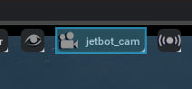

e quindi

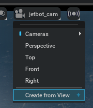

Posizionando la visuale sul punto in cui si vuole creare la camera e poi eseguendo tale procedimento, viene fuori una camera molto più pulita e ampia.

TODO: regolare i parametri e controllare se la distanza calcolata è corretta.

## Calibrazione camera dalla documentazione

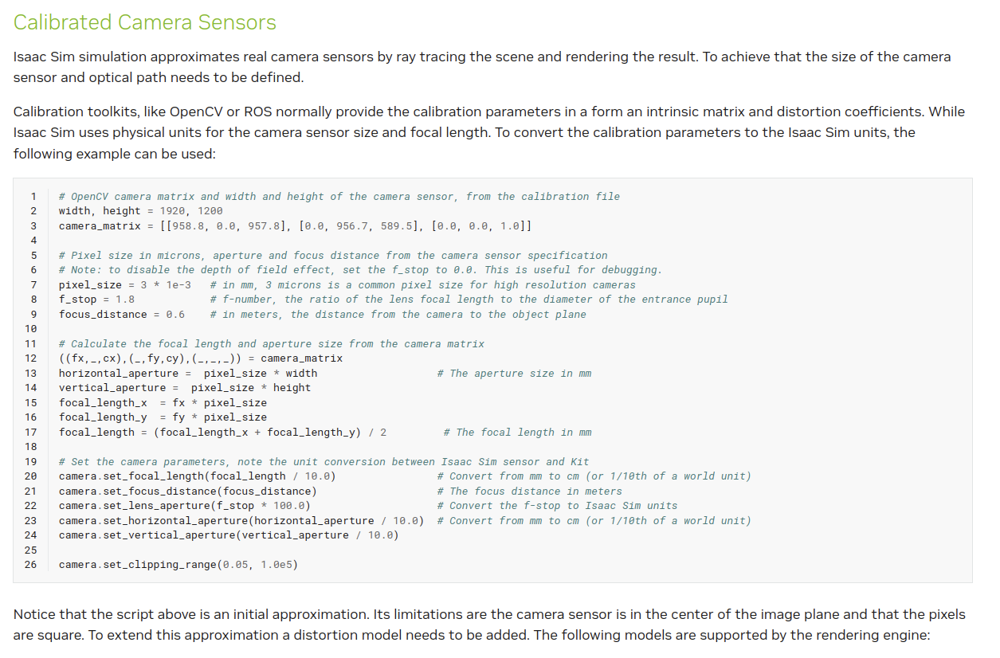

Cerco di eseguire il processo inverso, ovvero:

1. Da camera.get_focal_length ricavo focal length.

## Prova diversamente

Seguo il metodo di creazione camera e calibrazione utilizzato nella documentazione di Isaac a questo link: https://docs.omniverse.nvidia.com/isaacsim/latest/features/sensors_simulation/isaac_sim_sensors_camera.html

1. Posiziono la camera via script

## Esempio interessante (da vedere)

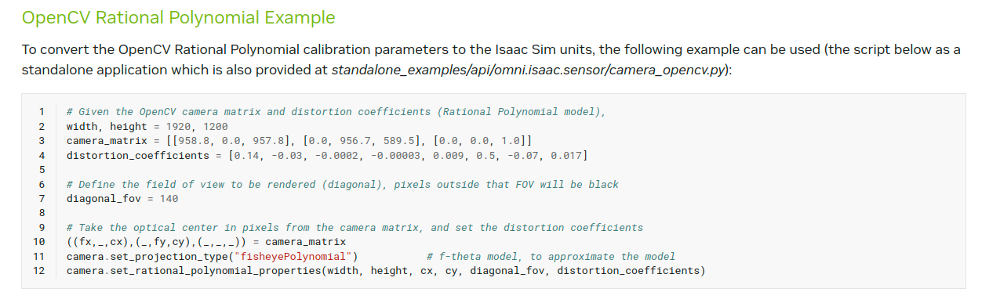

# DOPO VENTI ORE DI LAVORO HO SCOPERTO CHE ESISTE IL METODO GET_INTRINSICS_MATRIX()

Lo scarto tra la distanza calcolata tramite apriltags e quella calcolata manualmente tra la posizione della camera e quella del tag è:

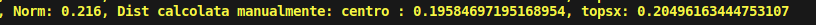

ovvero 1 cm dato che il calcolo è fatto sull'angolo in alto a sinistra. In alcuni casi anche meno:

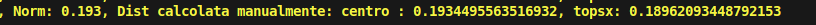

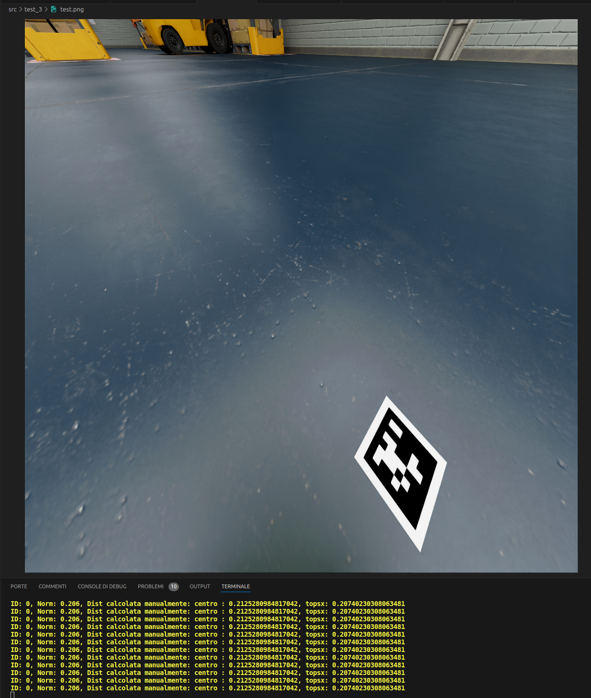

# TODO dati dal prof

1. Scrivere tutti i passaggi per installare il simulatore

   - Installazione omniverse
   - Installazione software dal launcher (isaac sim, assets, cache)
   - Creazione alias per il python del simulatore

2. Andare ad installarlo in laboratorio

- Vedere micromouse competition e movimento in diagonale
- https://github.com/teamlotto/Isaac-Sim-Warehouse/tree/main sto provando ad installare ed eseguire questo progetto

# Setup VSCode e autocomplete

Il modo più semplice per avere le librerie di Isaac importate in VSCode e quindi autocomplete quando si lavora con esse è quello di aprire con VSCode direttamente la cartella del package, ovvero
```.local/share/ov/pkg/isaac_sim-2023.1.1/```. Di conseguenza, sposto la cartella del progetto in tale cartella. Un problema di questo approccio è che la cartella del package contiene troppi file, quindi Pylance fatica a caricare i moduli. Decido quindi di spostare la cartella .vscode che si trova nella cartella principale all'interno della cartella ```thesis-project```, quindi semplicemente modificare tutti i percorsi all'interno di settings json nella lista ```"python.analysis.extraPaths"``` aggiungendo all'inizio di ognuno ```../```

```json
    // PRIMA
    "python.analysis.extraPaths": [
        "exts/omni.exporter.urdf",
        "exts/omni.exporter.urdf/pip_prebundle",
        "exts/omni.isaac.app.selector",
        ...
    // DOPO
    "python.analysis.extraPaths": [
        "../exts/omni.exporter.urdf",
        "../exts/omni.exporter.urdf/pip_prebundle",
        "../exts/omni.isaac.app.selector",
        ...

```

# Posizioni dei prim nella scena

La posizione e l'orientamento dei prim viene mostrata attraverso la Transform Matrix, che può essere locale e globale. Ecco come si interpeta la transform matrix:

>### Interpretazione delle Componenti della Matrice
>
>* **Prime tre colonne**:
>  * Ogni colonna delle prime tre righe rappresenta un vettore asse. Gli assi X, Y, Z del sistema di coordinate della camera sono trasformati in base alla rotazione (e alla scalatura, se applicata).
>  * Le prime tre colonne definiscono quindi come gli assi della camera sono orientati rispetto al sistema di coordinate globale (o al sistema di coordinate del genitore, nel caso di trasformazioni locali).
>
>* **Quarta colonna**:
>  * La quarta colonna rappresenta la traslazione della camera nel sistema di coordinate. Indica dove si trova l'origine della camera in questo sistema. Questi valori sono spesso in metri, ma l'unità di misura dipende dal contesto specifico dell'applicazione.
>
>* **Ultima riga**:
>  * L'ultima riga `(0, 0, 0, 1)` è standard nelle matrici di trasformazione affine in 3D e serve a mantenere la consistenza matematica per le operazioni di trasformazione.
>
>Nelle matrici di trasformazione 4x4 che hai fornito, le coordinate \(x, y, z\) che indicano la posizione della camera nel rispettivo sistema di coordinate sono date dall'elemento nella quarta colonna delle prime tre righe. Questo elemento rappresenta il vettore di traslazione della camera. Ecco come queste coordinate appaiono nelle due matrici che hai specificato:
>
>1. **Camera Position Matrix**:
>
>   $$
>   \begin{bmatrix}
>   -0.00403228 & -0.99999239 & 0.00140023 & 0 \\
>   0.81086778 & -0.00245040 & 0.58522767 & 0 \\
>   -0.58521979 & 0.00349492 & 0.81086906 & 0 \\
>   0.16708956 & -0.03213537 & 0.18715836 & 1 \\
>   \end{bmatrix}
>   $$
>
>   Posizione: $x = 0.16708956, y = -0.03213537, z = 0.18715836$
>
>2. **Local Camera Transform**:
>
>   $$
>   \begin{bmatrix}
>   -0.00416411 & -0.99999133 & 9.74542202 \times 10^{-9} & 0 \\
>   0.56640132 & -0.00235857 & 0.82412619 & 0 \\
>   -0.82411905 & 0.00343176 & 0.56640623 & 0 \\
>   0.07833982 & -0.00594328 & 0.11956879 & 1 \\
>   \end{bmatrix}
>   $$
>
>   Posizione: $x = 0.07833982, y = -0.00594328, z = 0.11956879$


# Installazione su windows

1. https://www.nvidia.com/en-in/omniverse/download/, fare il login e scaricare per Windows

2. Eseguire il launcher e accedere

3. Scaricare ISAAC SIM all'interno della libreria

Per sapere il percorso di installazione del package si può andare su LIBRERIA > Isaac Sim, quindi cliccare sulle tre lineette > Impostazioni. Per sviluppare il progetto usufruendo dell'autocomplete clono la repository all'interno della cartella principale. Nel mio caso è ```C:\Users\danyb\AppData\Local\ov\pkg\isaac_sim-2023.1.1```. Successivamente, per eseguire i programmi python all'interno del progetto mi basterà passare il loro percorso come argomento al ```python.bat``` che si trova nella cartella principale.

Per installare pacchetti aggiuntivi (mosquitto, apriltags) si può usare il comando `./python.bat -m pip install name_of_package_here`.

Prima di eseguire questo, ho aggiornato pip con `./python.bat -m pip install --upgrade pip`.

```bash
    ./python.bat -m pip install --upgrade pip
    ./python.bat -m pip install paho-mqtt
    ./python.bat -m pip install python-opencv
    ./python.bat -m pip install pyapriltags
```

## Cache

Per aumentare la velocità di avvio provo ad installare la cache. Basta andare su Libreria > Cache > Installa.

## Prima inclusione di Docker

Il primo container incluso nel progetto è quello di Mosquitto. All'interno della cartella test_4 ho inserito la cartella mosquitto contenente le tre sottocartelle 
* config contenente il file mosquitto.conf 
    ```yml 
        persistence true
        persistence_location /mosquitto/data/

        log_dest file /mosquitto/log/mosquitto.log
        log_dest stdout

        listener 1883

        allow_anonymous true
    ```
* data 
* log

Quindi all'interno della cartella test_4 il file docker-compose.yml
```yml
services:
    mqtt:
        container_name: mqtt
        image: eclipse-mosquitto
        restart: always
        volumes:
            - "./mosquitto/config:/mosquitto/config"
            - "./mosquitto/log:/mosquitto/log"
            - "./mosquitto/data:/mosquitto/data"
        expose:
            - 1883
        ports:
            - 1883:1883 
            - 9001:9001
        hostname: mqtt
```
A questo punto basterà eseguire il ```docker compose up``` per far avviare il broker, quindi eseguire lo script python.

# Estensioni

Il workflow standalone ha il difetto di dover caricare la scena ad ogni esecuzione, il che richiede molto tempo. Per ovviare a questo problema provo a seguire il workflow delle estensioni. Per fare ciò basta:
1. Aprire Isaac e caricare la scena ```scene_warehouse.usd```
2. Andare su Window > Extensions
3. Cliccare + > new extension template project, quindi selezionare una cartella e creare il progetto.