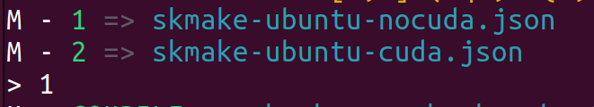
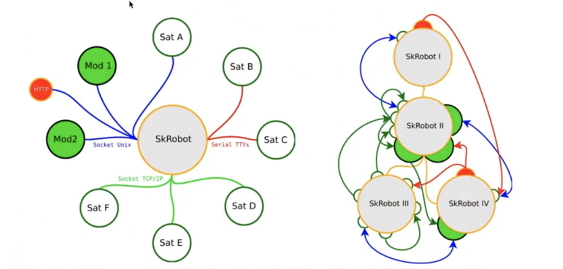
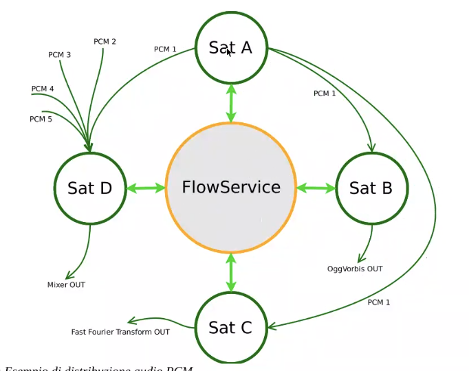
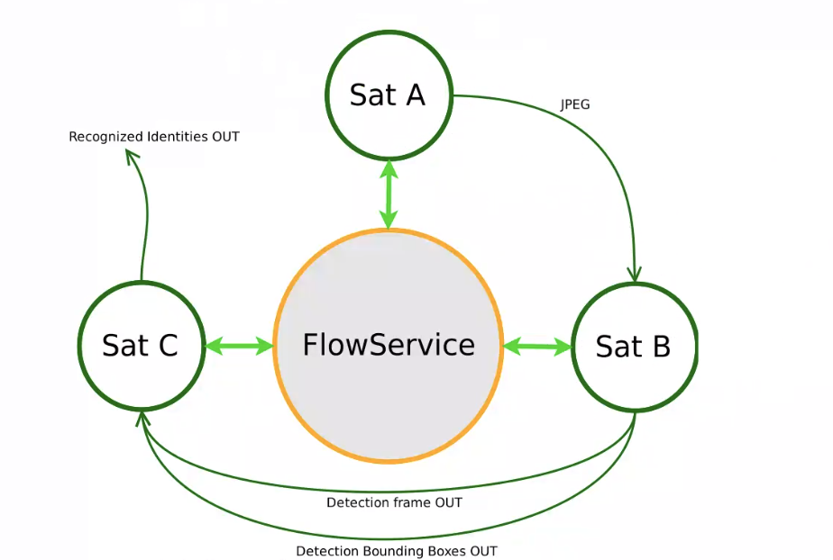
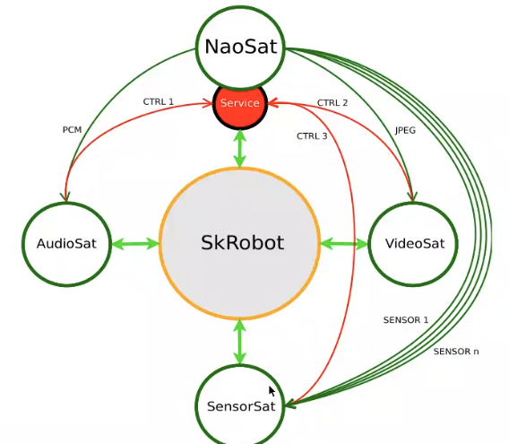

# Installazione senza CUDA

## Installazione skrobot

1. ```git clone https://gitlab.com/Tetsuo-tek/pck.git```
2. ```sudo -s```
2. ```cd pck```
3. ```pip install -r requirements_py3.txt```
4.    ```cd /usr/bin```
5.    ```ln -s python3 python```. Creiamo un link per non avere conflitti con Python 2.

6. ```cd <percorso-pck>```
6. ```./pck.py --check-base```
7. ```./pck.py --install-base``` e ```Y``` quando richiesto.
9. Incollare all'interno di ```~/.bashrc``` le seguenti righe: 
    ```bash
    export SK_HOME=/opt/Sk
    export SK_SRC=$SK_HOME/src
    export SK_BIN=$SK_HOME/bin
    export SK_ETC=$SK_HOME/etc
    export SK_SHR=$SK_HOME/share
    export SK_VAR=$SK_HOME/var
    export PATH=$PATH:$SK_BIN
    ```
10. Uscire da sudo con ```Ctrl+D``` ed incollare le stesse righe in ```~/.bashrc```.

10. Chiudere e riaprire il terminale
11. ```sudo -s```
12. ```pck --install SkRobot```
13. Selezionare 1 => nocuda

    


# Installazione con CUDA 11.5 e CUDNN 8.2.4

## Installazione CUDA, CUDNN e drivers nvidia

1. ```sudo ubuntu-drivers install``` #installazione drivers nvidia

2. ```sudo apt install nvidia-cuda-toolkit```
3. ```sudo apt install nvidia-cudnn```

A questo punto è importante controllare il percorso in cui è stato installato CUDA. Quando l'installazione viene fatta attraverso apt, il packet manager lo inserisce in ```/usr/lib/nvidia-cuda-toolkit/```, altrimenti potrebbe trovarsi in ```/usr/local/cuda-x.y```. Un metodo alternativo per trovare tale percorso è ```which nvcc```.

4. Inserire all'interno di ```~/.bashrc``` le seguenti righe:

    ```bash
    #CUDA
    export CUDA_HOME=/usr/lib/nvidia-cuda-toolkit/
    #il valore di CUDA_VERSION può essere ricavato tramite: nvcc --version
    export CUDA_VERSION=115.0
    export CUDA_BIN_PATH=$CUDA_HOME/bin
    export PATH=$CUDA_HOME/bin${PATH:+:${PATH}}
    export CUDACXX=$CUDA_BIN_PATH/nvcc
    export CUDA_NVCC_EXECUTABLE=$CUDACXX
    export CMAKE_CUDA_COMPILER=$CUDACXX
    export NVCC_PATH=$CUDACXX
    #il valore di CUDAARCHS può essere ricavato tramite: nvidia-smi --query-gpu=compute_cap --format=csv
    export CUDAARCHS=89 
    export CUDA_ARCHITECTURES=CUDAARCHS
    export CUDA_TOOLKIT_ROOT_DIR=$CUDA_HOME
    export LD_LIBRARY_PATH=${LD_LIBRARY_PATH}$CUDA_HOME/lib64
    ```

5. Chiudere e riaprire il terminale.
6. ```sudo apt install gcc-10 g++-10``` ATTENZIONE: con versioni successive di gcc ($\ge$ 11) non funziona la compilazione.

## Build OpenCV con CUDA

Per installare OpenCV con CUDA basta eseguire il seguente script:

```bash
#!/usr/bin/env bash
# 2019 Michael de Gans

set -e

# change default constants here:
readonly PREFIX=/usr/local  # install prefix, (can be ~/.local for a user install)
readonly DEFAULT_VERSION=4.8.0  # controls the default version (gets reset by the first argument)
readonly CPUS=$(nproc)  # controls the number of jobs

# better board detection. if it has 6 or more cpus, it probably has a ton of ram too
#if [[ $CPUS -gt 5 ]]; then
    # something with a ton of ram
    JOBS=$CPUS
#else
#    JOBS=1  # you can set this to 4 if you have a swap file
    # otherwise a Nano will choke towards the end of the build
#fi

cleanup () {
# https://stackoverflow.com/questions/226703/how-do-i-prompt-for-yes-no-cancel-input-in-a-linux-shell-script
    while true ; do
        echo "Do you wish to remove temporary build files in /tmp/build_opencv ? "
        if ! [[ "$1" -eq "--test-warning" ]] ; then
            echo "(Doing so may make running tests on the build later impossible)"
        fi
        read -p "Y/N " yn
        case ${yn} in
            [Yy]* ) rm -rf /tmp/build_opencv ; break;;
            [Nn]* ) exit ;;
            * ) echo "Please answer yes or no." ;;
        esac
    done
}

setup () {
    cd /tmp
    if [[ -d "build_opencv" ]] ; then
        echo "It appears an existing build exists in /tmp/build_opencv"
        cleanup
    fi
    mkdir build_opencv
    cd build_opencv
}

git_source () {
    echo "Getting version '$1' of OpenCV"
    git clone --depth 1 --branch "$1" https://github.com/opencv/opencv.git
    git clone --depth 1 --branch "$1" https://github.com/opencv/opencv_contrib.git
}

install_dependencies () {
    # open-cv has a lot of dependencies, but most can be found in the default
    # package repository or should already be installed (eg. CUDA).
    echo "Installing build dependencies."
    sudo apt-get update
    sudo apt-get dist-upgrade -y
    sudo apt-get remove --purge -y libopencv-dev libopencv*
    sudo apt-get -y autoremove
    sudo apt-get install -y \
        build-essential \
        cmake \
        git \
        gfortran \
        libatlas-base-dev \
	libavutil-dev \
        libavcodec-dev \
        libavformat-dev \
        libswresample-dev \
        libcanberra-gtk3-module \
        libdc1394-dev \
        libeigen3-dev \
        libglew-dev \
        libgstreamer-plugins-base1.0-dev \
        libgstreamer-plugins-good1.0-dev \
        libgstreamer1.0-dev \
        libgtk-3-dev \
        libjpeg-dev \
        libjpeg8-dev \
        libjpeg-turbo8-dev \
        liblapack-dev \
        liblapacke-dev \
        libopenblas-dev \
        libpng-dev \
        libpostproc-dev \
        libswscale-dev \
        libtbb-dev \
        libtbb2 \
        libtesseract-dev \
        libtiff-dev \
        libv4l-dev \
        libxine2-dev \
        libxvidcore-dev \
        libx264-dev \
        pkg-config \
        python3-dev \
        python3-numpy \
        python3-matplotlib \
        qv4l2 \
        v4l-utils \
        zlib1g-dev
}

configure () {
    local CMAKEFLAGS="
        -D BUILD_EXAMPLES=OFF
        -D BUILD_opencv_python2=OFF
        -D BUILD_opencv_python3=ON
        -D CMAKE_BUILD_TYPE=RELEASE
        -D CMAKE_INSTALL_PREFIX=${PREFIX}
        -D CUDA_ARCH_BIN=7.2 8.7 8.9
        -D CUDA_ARCH_PTX=
        -D CUDA_FAST_MATH=ON
        -D CUDNN_VERSION='8.2.4'
        -D EIGEN_INCLUDE_PATH=/usr/include/eigen3 
        -D ENABLE_NEON=OFF
        -D OPENCV_DNN_CUDA=ON
        -D OPENCV_ENABLE_NONFREE=ON
        -D OPENCV_EXTRA_MODULES_PATH=/tmp/build_opencv/opencv_contrib/modules
        -D OPENCV_GENERATE_PKGCONFIG=ON
        -D BUILD_EXAMPLES=OFF
        -D WITH_CUBLAS=ON
        -D WITH_CUDA=ON
        -D WITH_TBB=ON
        -D BUILD_TBB=ON
        -D WITH_GTK=ON
        -D WITH_CUDNN=ON
        -D WITH_DNN=ON
        -D WITH_GSTREAMER=ON
        -D WITH_LIBV4L=ON
        -D WITH_NVCUVID=OFF
        -D WITH_NVCUVENC=OFF
        -D WITH_OPENGL=ON
        -D CMAKE_C_COMPILER=gcc-10
        -D CMAKE_CXX_COMPILER=g++-10"

    if [[ "$1" != "test" ]] ; then
        CMAKEFLAGS="
        ${CMAKEFLAGS}
        -D BUILD_PERF_TESTS=OFF
        -D BUILD_TESTS=OFF"
    fi

    echo "cmake flags: ${CMAKEFLAGS}"

    cd opencv
    mkdir build
    cd build
    cmake ${CMAKEFLAGS} .. 2>&1 | tee -a configure.log
}

main () {

    local VER=${DEFAULT_VERSION}

    # parse arguments
    if [[ "$#" -gt 0 ]] ; then
        VER="$1"  # override the version
    fi

    if [[ "$#" -gt 1 ]] && [[ "$2" == "test" ]] ; then
        DO_TEST=1
    fi

    # prepare for the build:
    setup
    install_dependencies
    git_source ${VER}

    if [[ ${DO_TEST} ]] ; then
        configure test
    else
        configure
    fi

    # start the build
    make -j${JOBS} 2>&1 | tee -a build.log

    if [[ ${DO_TEST} ]] ; then
        make test 2>&1 | tee -a test.log
    fi

    # avoid a sudo make install (and root owned files in ~) if $PREFIX is writable
    if [[ -w ${PREFIX} ]] ; then
        make install 2>&1 | tee -a install.log
    else
        sudo make install 2>&1 | tee -a install.log
    fi

    cleanup --test-warning

}

main "$@"
```
Gli elementi che è necessario impostare per adattare l'esecuzione al proprio sistema sono:
1. ```DEFAULT_VERSION = x.y.z``` indicare la versione desiderata di OpenCV
2. I flag del cmake e soprattutto:
    * ```-D CMAKE_C_COMPILER=gcc-10```
    * ```-D CMAKE_CXX_COMPILER=g++-10```
    
    Perché, come detto in precedenza, altre versioni di gcc danno problemi.

Una volta eseguita l'installazione, è possibile controllare se è andata a buon fine tramite ```opencv_version -v```.

## Installazione skrobot

1. ```git clone https://gitlab.com/Tetsuo-tek/pck.git```
2. ```sudo -s```
2. ```cd pck```
3. ```pip install -r requirements_py3.txt```
4.    ```cd /usr/bin```
5.    ```ln -s python3 python```. Creiamo un link per non avere conflitti con Python 2.

6. ```cd <percorso-pck>```
6. ```./pck.py --check-base```
7. ```./pck.py --install-base``` e ```Y``` quando richiesto.
9. Incollare all'interno di ```~/.bashrc``` le seguenti righe: 
    ```bash
    export SK_HOME=/opt/Sk
    export SK_SRC=$SK_HOME/src
    export SK_BIN=$SK_HOME/bin
    export SK_ETC=$SK_HOME/etc
    export SK_SHR=$SK_HOME/share
    export SK_VAR=$SK_HOME/var
    export PATH=$PATH:$SK_BIN
    ```
10. Uscire da sudo con ```Ctrl+D``` ed incollare le stesse righe in ```~/.bashrc```.

10. Chiudere e riaprire il terminale
11. ```sudo -s```
12. ```pck --install SkRobot```
13. Selezionare 2 => cuda

    


# Operazioni successive 


## Cartella di avvio

Entrare in una cartella (nel mio caso ```Desktop/skrobot```), quindi:
1. ```mdkir launch & cd launch``` 
2. ```skrobot``` e ```Y``` quando richiesto.
3. ```Ctrl+C``` solo dopo che è partito, **NON durante l'avvio**. Se si gela devo aprire un altro terminale con lo stesso utente e fare ```killall -9 skrobot```.


## Installazione pacchetti
1. ```sudo -s```
2. ```pck --search nome-pacchetto```
3. ```pck --install nome-pacchetto```
4. ```pck --remove nome-pacchetto```
5. ```pck --list``` per elencare i pacchetti installati.

I repo vengono clonati in /opt/Sk/src e qui dentro vedo il codice. In var e pck ci sono altre informazioni di installazione e i repos.

## Installazione PySketch e link all'engine

1. ```sudo -s```
2. ```pck --install pysketch-template```
3. ```Ctrl+D```
4. Creo una cartella (nel mio caso ```Desktop/skrobot/sketches```) dove mettere tutti gli sketch e ci entro.
2. ```ln -s /opt/Sk/src/PySketch``` 
3. ```cp /opt/Sk/src/pysketch-template/pysketch-template.py .```

Per creare un nuovo sketch basterà modificare il file pysketch-template.

## Configurazione di skrobot

All'interno della cartella launch c'è il file ```robot.json```. Esso può essere modificato per gestire la configurazione del sistema. Alcuni esempi di attributi che vale la pena considerare sono:

* ```appName```: nome del mio skrobot e si vede in tmp come socket (ls -lh /tmp). Fatto per avviare più skrobot sulla stessa macchina
* ```enableTcpFs```: aprire o meno la porta TCP
* ```fsListenAddr```: indirizzo da cui riceve (0.0.0.0 significa tutto, 127.0.0.1 localhost)


## Definizione indirizzo connessione


Indico gli indirizzi per la connessione. tcp: lo uso se sto lavorando su più macchine.

1. Inserire all'interno di ```~/.bashrc``` le seguenti righe:
    * ```export ROBOT_ADDRESS=local:/tmp/Robot``` (Robot è il valore dell'attributo appName in robot.json)
    * ```#export ROBOT_ADDRESS=tcp:192.168.2.52```

A questo punto gli sketch potranno stabilire una connessione.


## Esecuzione di uno sketch e analisi log

Per eseguire lo sketch basta eseguirlo come ```./sketch-template.py```. Durante l'esecuzione viene stampata la seguente riga.


In ordine, i numeri rappresentano:
1. Frequenza
2. Tic time richiesto nello script
3. Tic time effettivo per correggere l'errore di python o c++ (python quando fa la sleep impiega del tempo in più, c++ del tempo in meno).
4. Tic time che risulta a python o c++.
5. Errore in secondi rispetto al tempo richiesto
6. Errore in percentuale rispetto al tempo richiesto.


Se l'errore aumenta troppo vuol dire che ho appesantito troppo il loop quindi posso:
1. Aumentare il tempo
2. Alleggerire il loop


# Teoria SKROBOT

v

Con pysketch sviluppo un "satellite". I satelliti si possono connetttere via TCP o via Socket (tipo quella chiamata Robot). A destra la versione multicentralizzata in cui si crea una rete più grande. Si possono spartire i lavori sui diversi satelliti (diversi processi sulla stessa macchina o su più macchine). Ad esempio se SkRobot può semplicemente raccogliere i diversi satelliti senza eseguire niente e senza avere bisogno di troppe risorse.  Il collegamento può essere fatto sia attraverso SkRobot sia peer to peer (troppo complesso). 



In questo esempio Sat A spedisce i dati audio (PCM 1) agli altri satelliti attraversi i **canali** (equivalente dei topic). Su un singolo flusso (freccia verde chiara) possono essere creati più canali. SatD e SatB si sottoscrivono ai canali e raccolgono PCM1. In questo caso vediamo lavoro in parallelo ma può essere fatto anche in cascata.



Questo è simile a quello che devo fare io. Si può parallelizzare SatB se ad esempio A restituisce 60 frame al secondo, creo 4 SatB oguno dei quali elabora un frame ogni quattro in ordine. UN modo per inviare dati efficiente è in binario, ad esempio un array di (x,y,width, leght) invece di inviarlo come json o csv si può inviare come array. I canali fatti fin'ora sono di streaming (1 a n), ma esistono canali di servizio 1 a 1 su cui si possono ricevere dei comandi.



Ad esempio in questo caso gli arancioni servono per mandare comandi al Nao.

# Coppelia

## Installazione
Per installare coppeliaSim su ubuntu 22.04 bisogna:
1. Andare su https://www.coppeliarobotics.com/#download
2. Scaricare il pacchetto per ubuntu 22.04
3. Estrarre il zip scaricato nella posizione più comoda
4. Eseguire coppeliaSim.sh

## Implementazione API

Per implementare le API in Python occorre innanzitutto installare il pacchetto da pip con ```pip install coppeliasim_zmqremoteapi_client```.


# AprilTags

1. ```pip install apriltag```