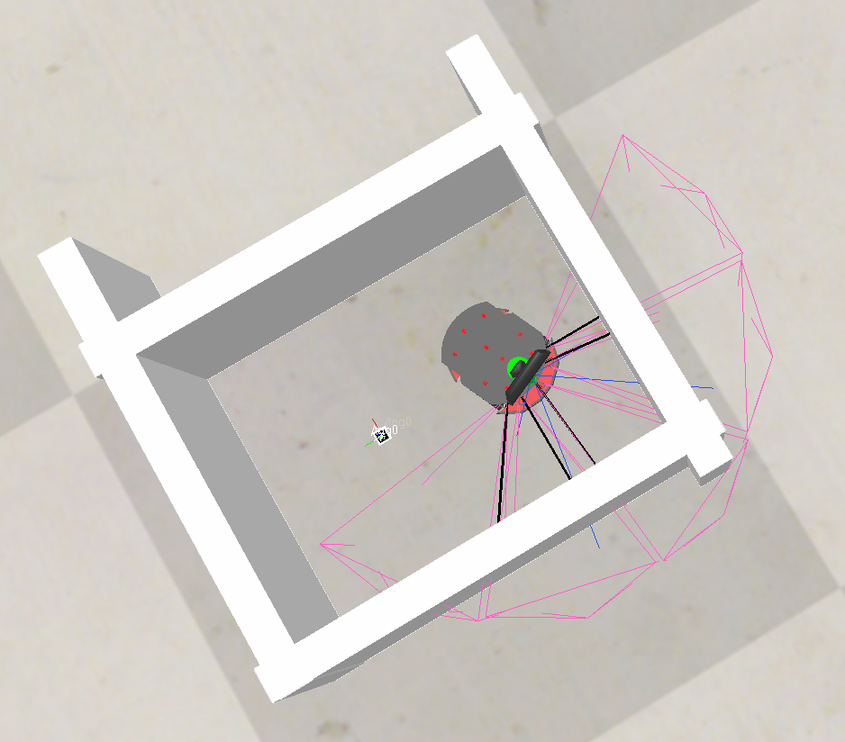
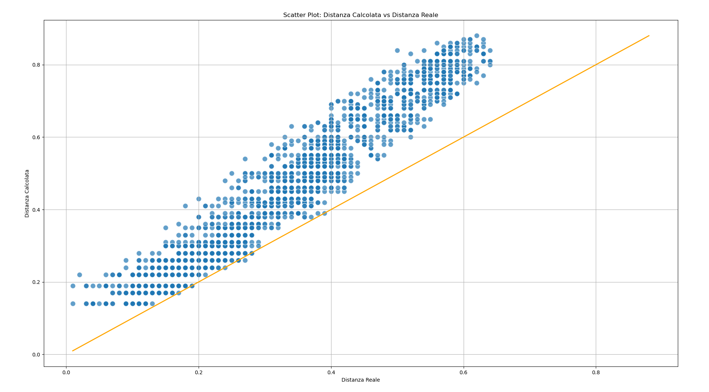
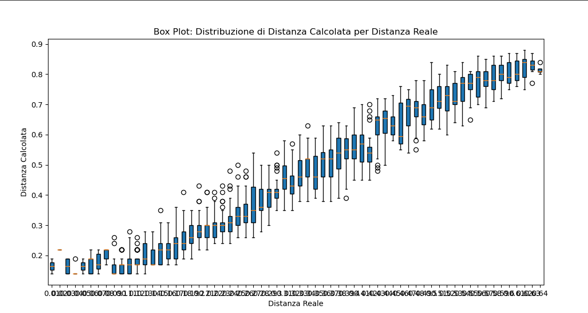
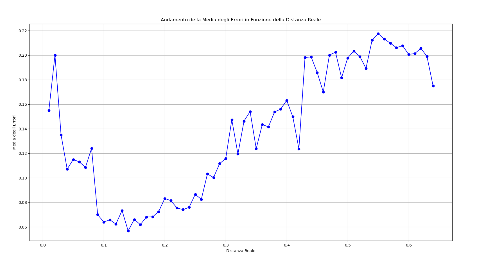

La detection da valori di distanza parecchio sbagliati. Ho lasciato il robot vagare all'interno di uno spazio chiuso con un apriltag sul pavimento.

Ho registrato ad ogni passaggio del tag nel campo visivo della camera la distanza reale e quella calcolata tramite il tag. Rappresentando tali valori su dei grafici si ottiene:

Ciò dimostra che l'errore non è uniforme (la funzione non è biettiva), e quindi non è possibile fare un semplice mapping. Bisogna scavare più a fondo e capire cosa causa questo problema.

Notiamo inoltre come l'andamento degli errori sia crescente quasi linearmente con l'aumento della distanza reale, tranne quando la distanza è molto ridotta.

