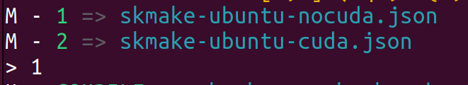

# Installazione senza CUDA

## Installazione skrobot

1. git clone https://gitlab.com/Tetsuo-tek/pck.git
2. sudo -s
2. pip install -r requirements_py3.txt

3. sudo -s
    cd /usr/bin
    ln -s python3 python  (creato un link perché su ubuntu 22.04 c'è ancora python 2)

4. ./pck.py --check-base 
4. ./pck.py --install-base 

Non da root incollare gli export stampati dall'installazione all'interno di .bashrc 

```bash
export SK_HOME=/opt/Sk
export SK_SRC=$SK_HOME/src
export SK_BIN=$SK_HOME/bin
export SK_ETC=$SK_HOME/etc
export SK_SHR=$SK_HOME/share
export SK_VAR=$SK_HOME/var
export PATH=$PATH:$SK_BIN
```

Per installare usarlo tramite sudo -s

4. apt install libopencv-dev
5. pck --install SkRobot
6. Selezionare 1 => nocuda

    


# Installazione con CUDA 12.4

## Installazione cuda e drivers nvidia

```bash
sudo ubuntu-drivers install #installazione drivers nvidia

wget https://developer.download.nvidia.com/compute/cuda/repos/ubuntu2204/x86_64/cuda-ubuntu2204.pin
sudo mv cuda-ubuntu2204.pin /etc/apt/preferences.d/cuda-repository-pin-600
wget https://developer.download.nvidia.com/compute/cuda/12.4.1/local_installers/cuda-repo-ubuntu2204-12-4-local_12.4.1-550.54.15-1_amd64.deb
sudo dpkg -i cuda-repo-ubuntu2204-12-4-local_12.4.1-550.54.15-1_amd64.deb
sudo cp /var/cuda-repo-ubuntu2204-12-4-local/cuda-*-keyring.gpg /usr/share/keyrings/
sudo apt-get update
sudo apt-get -y install cuda-toolkit-12-4

sudo apt-get install -y cuda-drivers
```

## Build OpenCV con CUDA

1. ```git clone https://github.com/opencv/opencv.git```
2. ```git clone https://github.com/opencv/opencv_contrib.git```
3. ```cd opencv_contrib && git checkout 4.9.0```
4. ```cd ../opencv && git checkout 4.9.0```
5. ```mkdir build && cd build```
6. ```sudo snap install cmake --classic```
6. ```cmake -D CMAKE_BUILD_TYPE=RELEASE -D CMAKE_INSTALL_PREFIX=/usr/local -D INSTALL_C_EXAMPLES=OFF -D WITH_TBB=ON -D WITH_CUDA=ON -D BUILD_opencv_cudacodec=ON -D ENABLE_FAST_MATH=ON -D CUDA_FAST_MATH=ON -D WITH_CUBLAS=ON -D BUILD_opencv_java=OFF -D BUILD_ZLIB=ON -D BUILD_TIFF=ON -D WITH_GTK=ON -D WITH_NVCUVID=ON -D WITH_FFMPEG=ON -D OPENCV_GENERATE_PKGCONFIG=ON -D OPENCV_PC_FILE_NAME=opencv5.pc -D OPENCV_ENABLE_NONFREE=ON -D WITH_GSTREAMER=ON -D WITH_V4L=ON -D WITH_QT=ON -D WITH_CUDNN=ON -D OPENCV_DNN_CUDA=ON -D OPENCV_EXTRA_MODULES_PATH=../../opencv_contrib_modules -D BUILD_EXAMPLES=ON ..```

https://www.youtube.com/watch?v=8zXHSfFyXZs


# Operazioni successive 

## Cartella di avvio

1. Creare cartella e ci entro
2. skrobot -> y quando c'è la domanda
3. ctrl + c (solo dopo che è partito, non durante l'avvio). Se si gela devo aprire un altro terminale con lo stesso utente e fare ```killall -9 skrobot```.


## Installazione pacchetti
1. sudo -s
2. pck --search nome-pacchetto
3. pck --install nome-pacchetto
4. pck --remove nome-pacchetto
5. pck --list

I repo vengono clonati in /opt/Sk/src e qui dentro vedo il codice. var pck ci sono altre informazioni di installazione e i repos.


## Link all'engine

1. Creo una cartella dove mettere tutti gli sketch e ci entro
2. ln -s /opt/Sk/src/PySketch 
3. cp /opt/Sk/src/pysketch-template/pysketch-template.py .

Per creare un nuovo sketch basterà modificare il file python

## Configurazione di skrobot

```nano robot.json```

* appName: nome del mio skrobot e si vede in tmp come socket (ls -lh /tmp). Fatto per avviare più skrobot sulla stessa macchina
* enableTcpFs: aprire o meno la porta TCP
* fsListenAddr: indirizzo da cui riceve (0.0.0.0 significa tutto, 127.0.0.1 localhost)


## Definizione indirizzo connessione


Indico gli indirizzi per la connessione. tcp: lo uso se sto lavorando su più macchine.
```
export ROBOT_ADDRESS=local:/tmp/Robot (nome appName in robot.json)
#export ROBOT_ADDRESS=tcp:192.168.2.52

```


## Analisi log dell'esecuzione di pysketch-template


primo numero: frequenza
secondo numero: tic time richiesto
terzo numero: tic time effettivo per correggere l'errore di python o c++
quarto numero: tic time che risulta a python o c++
quinto numero: errore in secondi rispetto al tempo richiesto
sesto numero: errore in percentuale rispetto al tempo richiesto.


Se l'errore aumenta troppo vuol dire che ho appesantito troppo il loop quindi posso:
1. aumentare il tempo
2. alleggerire il loop
